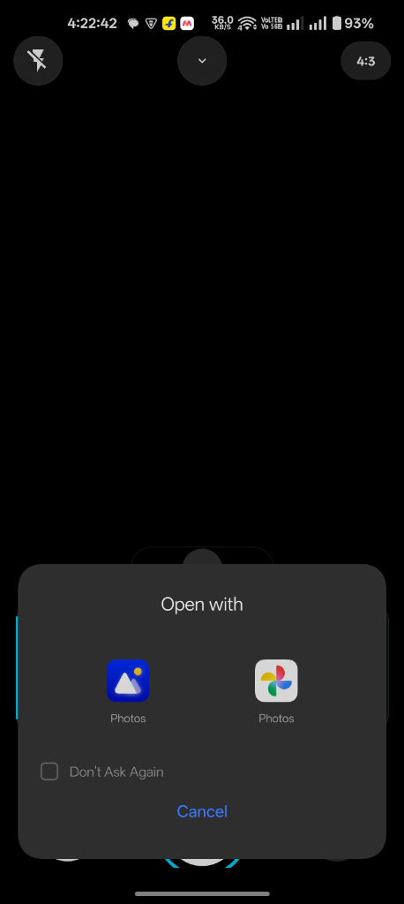
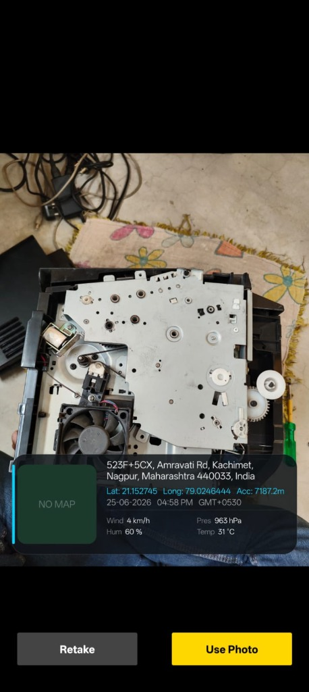
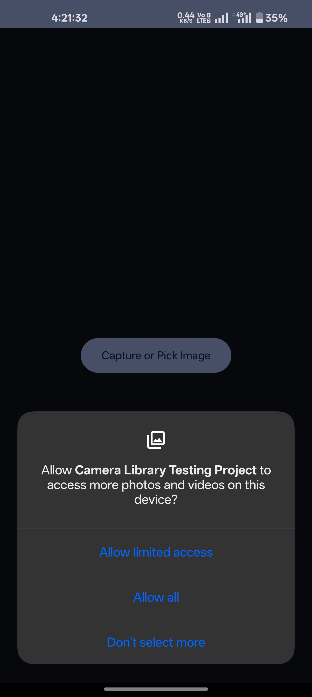
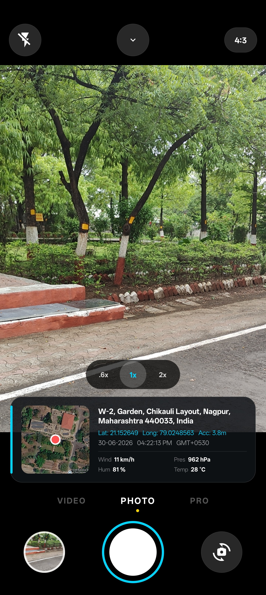
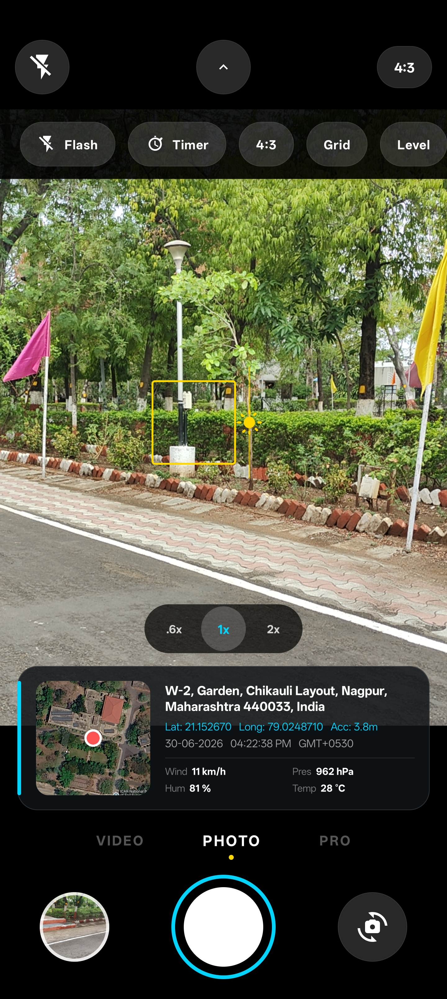
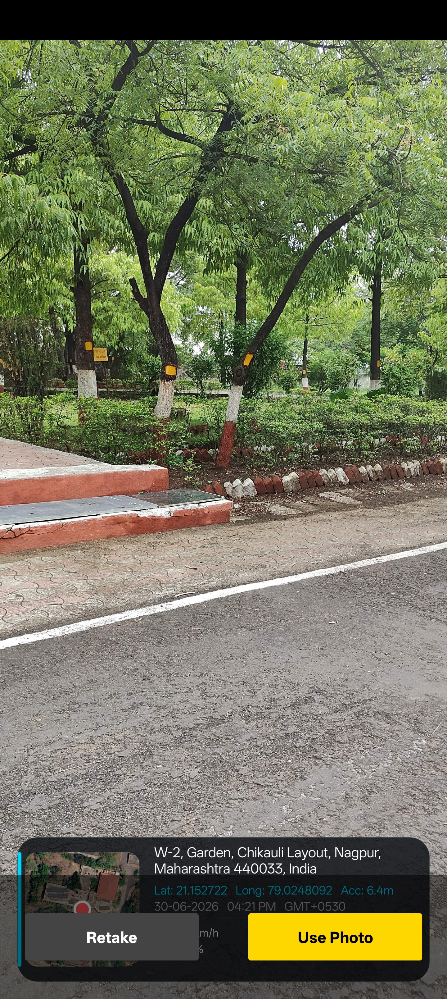
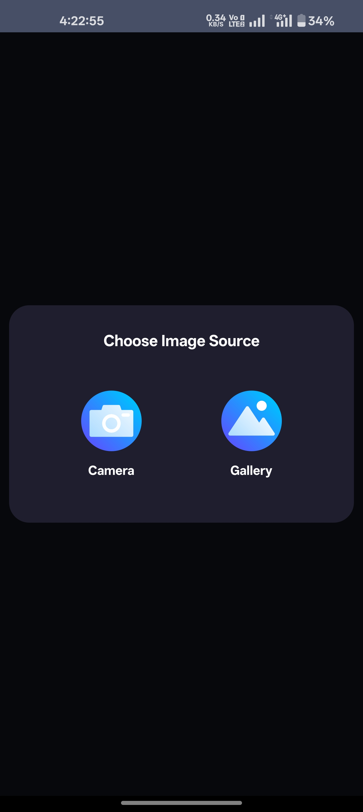

# 📸 GeotagCameraX

<p align="center">
  
  
  
</p>

GeotagCameraX is a highly customizable, production-ready Android library that allows users to capture photos or pick from their gallery, and automatically stamps them with a beautiful **Glassmorphism Watermark** containing real-time location data, coordinates, weather, and a map snapshot.

---

## ✨ Features

- **📸 Dual Image Source**: Built-in popup dialog to let users choose between taking a new photo or picking an existing one from the gallery.
- **🌍 Dynamic Geotagging**: Automatically fetches highly accurate latitude and longitude.
- **☁️ Weather Integration**: Pulls real-time weather data (temperature & conditions) using the Open-Meteo API.
- **🗺️ Live Map Snapshot**: Automatically injects a live Google map view of the location directly onto the photo.
- **💎 Glassmorphism Design**: Premium UI overlay for the watermark and a beautiful full-screen preview interface.
- **🛡️ Auto-Permissions**: Handles all dangerous permissions (Camera, Location) gracefully.

---

## 🖼️ Screenshots

| Picker | Preview | Camera | Result |
|:------:|:-------:|:------:|:------:|
|  |  |  |  |

| Screen 2 | Screen 3 | Screen 4 | Screen 5 |
|:---------:|:--------:|:--------:|:--------:|
|  |  |  |  |

---

## 🚀 Installation (via JitPack)

**Step 1:** Add the JitPack repository to your build file.

In your root `settings.gradle` (or `build.gradle` for older projects) add:
```groovy
dependencyResolutionManagement {
    repositoriesMode.set(RepositoriesMode.FAIL_ON_PROJECT_REPOS)
    repositories {
        google()
        mavenCentral()
        maven { url 'https://jitpack.io' } // <-- Add this line
    }
}
```

**Step 2:** Add the dependency to your app-level `build.gradle`:
```groovy
dependencies {
    implementation 'com.github.rahul360prasad:geotag-camera-lib:1.0.2'
}
```

---

## 💻 Usage

Using GeotagCameraX is incredibly simple. We use the standard modern `ActivityResultLauncher` API to communicate with the library.

### 1. Initialize the Launcher
In your host `Activity` or `Fragment`, create an instance of the launcher using the provided utility class:

```java
public class MainActivity extends AppCompatActivity {
    
    private GeotagCameraLauncher cameraLauncher;

    @Override
    protected void onCreate(Bundle savedInstanceState) {
        super.onCreate(savedInstanceState);
        setContentView(R.layout.activity_main);

        // 1. Initialize the launcher
        cameraLauncher = new GeotagCameraLauncher(this, new GeotagCameraLauncher.GeotagCameraCallback() {
            @Override
            public void onImageReady(String imagePath) {
                // Success! The fully watermarked image is saved at this path
                File finalImage = new File(imagePath);
                
                // Do something with the file (e.g. upload to server, display in ImageView)
            }

            @Override
            public void onError(String errorMessage) {
                Toast.makeText(MainActivity.this, "Error: " + errorMessage, Toast.LENGTH_SHORT).show();
            }
        });

        // 2. Launch the library on button click
        findViewById(R.id.btn_open_camera).setOnClickListener(v -> {
            cameraLauncher.launch(); 
        });
    }

    // 3. Delegate results back to the library
    @Override
    public void onRequestPermissionsResult(int requestCode, @NonNull String[] permissions, @NonNull int[] grantResults) {
        super.onRequestPermissionsResult(requestCode, permissions, grantResults);
        cameraLauncher.onRequestPermissionsResult(requestCode, permissions, grantResults);
    }

    @Override
    protected void onActivityResult(int requestCode, int resultCode, Intent data) {
        super.onActivityResult(requestCode, resultCode, data);
        cameraLauncher.onActivityResult(requestCode, resultCode, data);
    }
}
```

### 2. Android Manifest Requirements
Because the library handles camera, location, and storage, ensure your app's `AndroidManifest.xml` includes these core permissions (the library will automatically ask the user for runtime permission):

```xml
<uses-feature android:name="android.hardware.camera" android:required="false" />
<uses-permission android:name="android.permission.CAMERA" />
<uses-permission android:name="android.permission.ACCESS_FINE_LOCATION" />
<uses-permission android:name="android.permission.ACCESS_COARSE_LOCATION" />
<uses-permission android:name="android.permission.INTERNET" />
```

---

## 🏗️ Under The Hood (Architecture)

1. The host app calls `launch()`.
2. The library displays an **Image Source Popup** (Camera vs. Gallery).
3. Based on the choice, it acquires the original photo.
4. It fetches **Location** (Play Services), **Weather** (Open-Meteo), and **Map data**.
5. It renders a beautiful Glassmorphism watermark overlay over the image asynchronously.
6. The user is presented with a **Preview Screen** to either "Retake" or "Use Photo".
7. On approval, the final flattened image path is returned to the host app!

---

## 👨‍💻 Developer
Developed with ❤️ by **Rahul Prasad** (@rahul360prasad)
